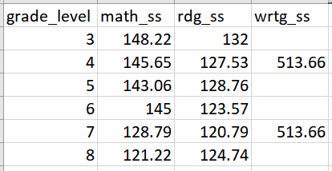

# Creating Equity Metrics
*Using Texas state testing data files*
*Programmed in R*

## Getting Started

# TODO: Let's put some text here explaining what you'll need

To complete this tutorial you'll need R, RStudio, and the following packages 
installed on your machine: 


```{r knitrSetup, echo=FALSE, error=FALSE, message=FALSE, warning=FALSE, comment=NA}
# Set options for knitr
library(knitr)
knitr::opts_chunk$set(comment=NA, warning=FALSE, echo=TRUE,
                      root.dir = normalizePath("../"),
                      error=FALSE, message=FALSE, fig.align='center',
                      fig.width=6, fig.height=6, dpi = 144, 
                      fig.path = "../figure/E_", 
                      cache.path = "../cache/E_")
options(width=80)
```


<div class="navbar navbar-default navbar-fixed-top" id="logo">
<div class="container">

</div>
</div>

### Objective

In this guide, you will use data visualization and descriptive statistics to
investigate equity in student testing outcomes along lines of race, income,
gender, learning differences, English proficiency, and migrancy status.

### Using this Guide

This guide utilizes mock data from Texas's standardized exams (STAAR test,
grades 3-8). Therefore, Texas districts can use this code to directly analyze
the testing data files they have received from the Texas Education Agency.
However, the code can be adapted to any other state or district context in which
student testing outcomes are analyzed.

Once you have identified analyses that you want to try to replicate or modify,
click the "Download" buttons to download R code and sample data. You can make
changes to the charts using the code and sample data, or modify the code to work
with your own data. If you are familiar with Github, you can click "Go to
Repository" and clone the entire repository to your own computer.

Go to the Participate page to read about more ways to engage with the OpenSDP
community or reach out for assistance in adapting this code for your specific
context.

### About the Data

The data used in this guide was synthetically generated, and it was formatted to
match the Texas Education Agency's state test file formats (Texas's file formats
can be found here: https://tea.texas.gov/student.assessment/datafileformats).
The data has one record per student. Out of the hundreds of features reported
for each student by the Texas Education Agency, we used (and retained) the
following features in our analysis: student grade level (3-8), school code,
student ID, gender, race-ethnicity, economic disadvantage level, Limited English
Proficiency level, and scale scores in reading, math, and writing (for the STAAR
state test). We also used indicators of whether or not the student attended a
Title 1 school, was a migrant, and was enrolled in special education. Here is a
key of the features and their variable names in our simulated dataset:

| Feature name    | Feature Description                                 |
|:-----------     |:------------------                                  |
| `grade_level`   | Grade level of exam student took (3-8)              |
| `school_code`   | School ID number                                    |
| `sid`           | Student ID number                                   |
| `male`          | Student gender                                      |
| `race_ethnicity`| Student race/ethnicity                              |
| `eco_dis`       | Student level of economic disadvantage              |
| `title_1`       | Indicator if student attends Title 1 school         |
| `migrant`       | Indicator if student is a migrant                   |
| `lep`           | Level of Limited English Proficiency                |
| `iep`           | Indicator if student enrolled in special education  |
| `rdg_ss`        | Scale score for reading exam                        |
| `math_ss`       | Scale score for math exam                           |
| `wrtg_ss`       | Scale score for writing exam                        |  
| `composition`   | Score on writing composition exam                   |

The original Texas Education Agency data files have hundreds of features
attached to each student record. Coding our analyses with all of these features
could get unwieldy, so the best practice is to select the key features we will
need for our analyses. If you would like to directly use your own data with the
code from this guide, it is best to delete unecessary features and change the
headers to the feature names we chose (above). A more detailed data definition
guide can be found in the `man` folder in the Github repository.

Although not required, it is useful to compile a small table of the standard
deviations of the scores on the exams statewide, broken down by grade and
subject area. This will allow us to compute more standardized measures of gaps
in the following code. Here is an example of the expected table format, using
standard deviations by grade and tested area from the 2014 Texas state STAAR
exams:



This standard deviation table is used in the code, specifically imported into
the `sd_table` variable.

#### Loading the OpenSDP Dataset and R Packages

This guide takes advantage of the OpenSDP synthetic dataset and several key R
packages. The first chunk of code below loads the R packages (make sure to
install first!), and the second chunk loads the dataset and provides us with
variable labels. You can change the variable labels depending on the variables
in your dataset.

```{r packages, eacho=FALSE}
#Packages
library(tidyverse) # main suite of R packages to ease data analysis
library(ggplot2) # to plot
library(FSA) # functions for useful summary tables
# Read in some R functions that are convenience wrappers
source("../R/functions.R")

```

```{r loaddataset, eacho=FALSE}
# // Step 1: Read in csv file of our dataset, naming it "texas_data"
texas_data <- read.csv("../data/synth_texas.csv")  

# // Step 2 (Optional): Read in file containing state-wide standard deviations for standardized tests
sd_table <- read.csv("../data/sd_table.csv")

# // Step 3: Create a vector of labels for feature names in our dataset 
#These labels will appear in visualizations and tables
labels <- c("Grade","School ID","Student ID","Gender", "Race-Ethnicity",
            "Econ Disadvantage Status","Title 1 Status","Migrancy Status",
            "LEP Status","Spec Ed Enrolled","Reading Score",
            "Math Score","Writing Score","Writing Comp Score")


#Pairs labels with feature names from file
names(labels) <- c("grade_level","school_code","sid","male","race_ethnicity",
                   "eco_dis","title_1","migrant",
                   "lep","iep","rdg_ss",
                   "math_ss","wrtg_ss","composition")

## Set state proficiency levels
prof_lev <- expand.grid(grade = 3:8, subject = c("math_ss", "rdg_ss"),
               prof_level = c("approaching", "meets", "masters"))

prof_lev$score <- c(1360, 1467, 1500, 1536, 1575, 1595, 
                  1345, 1434, 1470, 1517, 1567, 1587, 
                  1486, 1589, 1625, 1653, 1688, 1700, 
                  1468, 1550, 1582, 1629, 1674, 1700, 
                  1596, 1670, 1724, 1772, 1798, 1854, 
                  1555, 1633, 1667, 1718, 1753, 1783)
```


### About the Analyses

In various contexts, students of different identity markers (race, class,
gender, English Language Learner status, etc.) may have systematically differing
educational outcomes. These gaps often present themselves in standardized
testing data, at the national, state, and local levels. The following analyses
will assist your organization in seeing where gaps exist and how wide they are,
in order to inform the conversation about why the gaps exist and what to do
about them.

### Giving Feedback on this Guide
 
This guide is an open-source document hosted on Github and generated using R
Markdown. We welcome feedback, corrections, additions, and updates. Please visit
the OpenSDP equity metrics repository to read our contributor guidelines.

## Analyses

We will now walk through a series of four analysis in this guide. The first will 
be a basic exploration of the performance gaps by subgroups on the assessments. 
THe next will look at how the gaps vary across schools. The third will model 
a targeting exercise to identify schools for possible intervention or further 
investigation. The final analysis will use regression modeling to look at the 
magnitude of the largest gap(s) in the district while controlling for other 
factors. 


### Exploratory Analysis

**Purpose:** Descriptive statistics give your agency a quick snapshot of current
achievement gaps among students, identifying areas for further investigation and
analysis.

**Required Analysis File Variables:**

- `grade_level` 
- `school_code` 
- `male`        
- `race_ethnicity` 
- `eco_dis`      
- `title_1`     
- `migrant`     
- `lep`
- `iep`
- `rdg_ss`
- `math_ss`
- `wrtg_ss`
- `composition`

**Ask Yourself**

- How do different student subgroups in your organization perform on
standardized tests?
- Which differences do you want to explore further?

**Analytic Technique:** Identify major achievement gaps within the student
population. To achieve this, we use the SDP function `gap.test`, which is
defined in the repository's `R` folder. You can review the source code of this 
function there. For now, here is the usage information:

`gap.test`: Visualizes and quantifies gaps in student performance across
demographic markers.

Output: A `data.frame` table of the top `n` gaps, as measured by effect size, as
well as the demographic and test information for each gap. Function also prints
comparative visuals of top gaps.

Inputs:

`gap.test(df, grade, outcome, features, n = 3, sds = NULL, comp = FALSE, cut = NULL, med = FALSE, outlbl = NULL)`

- df = dataset, should be wide format, one row per student, and have column for
grade level (class: data frame)
- grade = name of tested grade column in dataset (class: character)
- outcome = name of outcome variable (usually test scores) in dataset (class: character)
- features = vector of features in dataset where testing for gaps (class: character)
- n (optional) = Number of largest gaps the function outputs (class: integer, default: 3)
- sds (optional) = dataframe containing the state-wide standard deviations for all outcomes/exams (class: data frame, default: NULL)
- comp (optional) = Indicator to output additional comparative gap graphics
(class: boolean, default: FALSE)
- cut (optional) = Minimum number of students for level in a gap (class:
integer, default: NULL)
- med (optional) = Indicator if would like function to also output standardized
difference of medians, in addition to effect size (class: boolean, default:
FALSE)
- outlbl (optional) = label for measurd outcome, to print on graphs (class:
character, default: NULL)

More detailed usage information can be found in the `R` folder in the GitHub
repository. We use the function here to find the top 3 gaps in math scores, in
terms of effect size, between students of different economic disadvantage
levels, races, genders, Special Education statuses, and LEP statuses. We check
among all grades in the dataset: 3-8. The number of top gaps shown can be
changed based on user inputs, as well as the gap categories and subject areas
measured.

```{r GapTest, echo=TRUE}
#Use 'gap.test' function to explore most major gaps in student population
gap.table <- gap.test(df = texas_data,
                    grade = "grade_level",
                    outcome = "math_ss",
                    features = c('eco_dis','lep','iep','race_ethnicity','male'),
                    sds = sd_table,
                    n = 3,
                    cut = 120,
                    outlbl = "math score gap")
```

The `gap.test` output shows us that the top 3 gaps, in terms of effect size, are
for 3rd, 4th, and 5th grade math scores between gender groups. The effect sizes
are negative, and the labeling on the graph shows us the effect size was
calculated with the average score for male "M" students subtracted from the
average score for female "F" students. Thus, on average, the male students
scored higher than female students. In our dataset, these gaps were wider than
any other gap based in racial differences, socioeconoimc differences,
differences in English proficiency status, or differences in special education
status.

The function also outputs a table with each effect size, mean difference (to
show the gap on the scale of the test), and demographic information of the gap
(groups affected, grade level, test subject). We have stored this as
`gap.table`. If wanted, the user could set the inputs (see usage information
above) of the function such that it outputs additional graphics, comparing gaps
within each dataset feature. Here, we output one graphic for simplicity.

Measuring the gaps in terms of effect size allows us to compare gaps across
grade levels and subject areas, as effect size standardizes the gap by taking
into account the pooled standard deviation of the tested groups on the tests
they took. A good rule  of thumb is that an effect size greater in magnitude
than 0.1 usually translates to meaningful differences in student learning.
Hence, horizontal lines are labeled on the graph at 0.1 and -0.1. Gaps that
surpass these thresholds should be looked at more thoroughly. The gender gaps in
our data surpass this threshold and are similar across grade levels. For
simplicity, this report will focus on one grade level, but the following
analyses can be done across grade levels.

One technical note: Sometimes the distibutions of test scores can be skewed,
making the median a more advantageous measure of central tendency (since it is
less sensitive to outliers and skew). In these cases, set the `gap.test`
function's `med` parameter to `TRUE` to output a plot that shows the top 3 gaps
as measured by the standardized median difference.

Since our largest effect size gap was the grade 3 gender gap on the standardized
math test, we will explore that gap further. For demonstration purposes, we will
focus on just that one gap here. However, the next chunk of code will determine
which gap(s) will be explored in the rest of our analyses. The user can explore
multipe gaps at once by setting the following variables to include multiple gaps
from `gap.table`. This is shown in commented out code in the middle of the
chunk.

```{r SetGaps, echo=TRUE}
# // Option 1: Choose to analyze just the largest gap
gaps <- gap.table[1,]
rownames(gaps) <- NULL

# // Option 2: Choose to analyze the top 'k' gaps
#gaps <- gap.table[1:k,]
#rownames(gaps) <- NULL

# // Option 3: Choose to analyze the 'kth' through 'jth' gaps
#gaps <- gap.table[k:j,]
#rownames(gaps) <- NULL

# // Option 4: Choose to analyze the 'kth' gap only
#gaps <- gap.table[k,]
#rownames(gaps) <- NULL

# // Step 2: Set the number of gaps you'll be analyzing
n.gaps <- 1

```

**Analytic Technique:** Calculate the summary statistics for exam performance,
for all students at the grade level(s) in which gaps are measured. This will
give us a few points of reference. Here, we look at the distribution of scores
on the 3rd grade math test.

```{r Averages, echo=TRUE}
#Prints summary statistics for each gap's grade level
#Loop over gap number in our table of gaps
for(i in 1:n.gaps){
  
  #Save grade and subject tested information
  grade <- gaps[i,"grade_level"]
  subject <- gaps[i,"outcome"]
  
  data = texas_data[texas_data$grade_level == grade,] #Isolates grade level
  print(paste("Grade level:",grade,", Outcome:",labels[subject]))
  a <- summary(data[,subject]) #Summary stats table for grade and test
  print(a) #Print summary table
  
}#End loop over gap number

```

One particularly useful output in this summary is that we see the minimum and
maximum scores in our dataset, which gives us a rough sense of the bounds for
scores on this type of exam. It is tough to get a sense of the shape of the
distribution from summary statistics alone, so we will turn to visualization.

**Analytic Technique:** Create visualizations of the data, to provide a more
developed sense of the distributions behind these summary statistics.
Specifically, here we use box plots and histograms

```{r VisualizeTotals, echo=TRUE}
# // Visualizations: Box plots and Histograms
#Loop over gap number in our table of gaps
for(i in 1:n.gaps){
  
  #Save grade and subject tested information
  grade <- gaps[i,"grade_level"]
  subject <- gaps[i,"outcome"]
  
  data = texas_data[texas_data$grade_level == grade,] #Isolates 5th and 8th graders
  
    #Set variables and parameters for our boxplot
    p <- ggplot(data, aes(x=as.factor(grade_level), y=data[,subject])) + 
          geom_boxplot() +
          ggtitle(paste("Grade:",grade,",",labels[subject], "(all students)")) +
          scale_y_continuous(name=labels[subject]) +
          scale_x_discrete(name="Grade Level")
    
    p <- add_ref_levels(plot = p, prof_levels = prof_lev, direction = "horizontal", 
                         grade = grade, subject = subject) + theme_bw()
        print(p) #Print boxpolot
    
    #Set variables and parameters for our histogram
    p <- ggplot(data, aes(x=data[,subject])) + 
          ggtitle(paste("Grade:",grade,",",labels[subject], "(all students)"))+
          geom_histogram(alpha = 0.5, binwidth = 50, fill = "dodgerblue", 
                         color = "dodgerblue") + 
          scale_x_continuous(name=paste(labels[subject])) 
    # This function adds reference lines for proficiency levels to a plot of test 
    # scores, it uses the defined proficiency level object prof_lev, that we input 
    # above to augment the plot with proficiency levels
    p <- add_ref_levels(plot = p, prof_levels = prof_lev, direction = "vertical", 
                         grade = grade, subject = subject) + 
      theme_bw()
    
    
    print(p) #Print histogram
    

}#End loop over gap number

```

We see left skew in the distribution of scores, as evidenced by the box plot and
(more clearly) evidenced by the histogram. With skew present, it often makes
sense to use the median as a measure of central tendency, since it is less
susceptible to skew than the mean. We will keep this in mind during our
forthcoming analyses.

**Analytic Technique:** Compare descriptive statistics among the different
student demographic populations described in our gap. Now that we have some
measures for the performance on exams among all of our students, we can create
those same measures for male and female students. Then, we can compare them.

```{r DescriptiveDemographics, echo=TRUE}
# // Comparisons: Generating summary stats for demographics in gaps
#Loop over gap number in our table of gaps
for(i in 1:n.gaps){
  
  #Save grade, subject tested, and demographic information
  grade <- gaps[i,"grade_level"]
  subject <- gaps[i,"outcome"]
  dem <- gaps[i,"feature"]
  lvl1 <- gaps[i,"level_1"]
  lvl2 <- gaps[i,"level_2"]
  
  #Isolate data for grade and gap demographics
  data = texas_data[texas_data$grade_level == grade,] #Isolates grade level
  data = data[data[,dem] == lvl1 | data[,dem] == lvl2, ]#Isolates demographic groups
  
  #Print subject and grade level
  print(paste("Grade:",grade,",",labels[subject])) 

  a <- Summarize(data[, subject] ~ data[, dem]) #Makes comparison table
      colnames(a)[1] <- labels[dem] #Labels comparison table
      print(a) #Prints comparison table
  
} #End loop over gap number

```

We can see that we have more male than female students in our data. In addition,
each statistic (Q1, median, mean, Q3, min, max) is shifted up about 40 points
for males, compared to females. This suggests that the distributions share a
shape, but are centered at different scale scores. We will explore this
hypothesis directly by looking at shapes through visualization.

**Analytic Technique:** Visualize the comparisons, to give us a sense of scale
and shape in these gaps. To do so, we will use both box plots broken down by
gender and a stacked histogram broken down by gender.

```{r VisualizeEcoDis, echo=TRUE}
# // Step 1: Initialize a set of distinguishable colors for graphics
colors <- c("red","dodgerblue3","green","coral","violet","burlywood2","grey68")

#Loop over gap number in our table of gaps
for(i in 1:n.gaps){
  
  #Save grade, subject tested, and demographic information
  grade <- gaps[i,"grade_level"]
  subject <- gaps[i,"outcome"]
  dem <- gaps[i,"feature"]
  lvl1 <- gaps[i,"level_1"]
  lvl2 <- gaps[i,"level_2"]
  
  data = texas_data[texas_data$grade_level == grade,] #Isolates grade level
  data = data[data[,dem] == lvl1 | data[,dem] == lvl2, ]#Isolates demographic groups
      
  #Set variables and parameters for our boxplot
  bp <- ggplot(data, aes(x=as.factor(data[,dem]), y=data[,subject])) + 
        geom_boxplot() +
        ggtitle(paste("Grade:",grade,",", labels[subject],", by",labels[dem])) +
        scale_y_continuous(name=labels[subject]) +
        scale_x_discrete(name=labels[dem]) + 
    theme_bw()
  # print(bp) #Print box plot
  
    bp <- add_ref_levels(plot = bp, prof_levels = prof_lev, direction = "horizontal", 
                         grade = grade, subject = subject)
    print(bp)
  
  #Set variables and parameters for our histogram
  h <- ggplot(data, aes(x=data[,subject], fill = as.factor(data[,dem]))) + 
        ggtitle(paste("Grade:",grade,",", labels[subject],", by",labels[dem]))+
        geom_histogram(alpha = 0.5, binwidth = 50) + 
        scale_fill_manual(name=labels[dem],
                          values=colors[1:length(levels(as.factor(data[,dem])))])+
        scale_x_continuous(name=paste(labels[subject], ", Grade", grade)) 
  # print(h) #Print histogram
  
  h <- add_ref_levels(plot = h, prof_levels = prof_lev, direction = "vertical", 
                         grade = grade, subject = subject) + theme_bw() +
    theme(legend.position = c(0.2, 0.8)) 
    print(h)
  

} #End loop over gap number
```

As we predicted, the distributions have similar shapes, with the male
distribution shifted to higher scores than the female distribution. When broken
down by gender group, the distributions maintain a left skew, which provides
even more support for using the median as a measure of central tendency in the
following analyses.

**Analytic Technique:** Explore gap within levels of another data feature.
Often, it can be helpful to look at the intersections of the demographic data we
pulled. In particular, exploring possible gaps among combinations of race,
socioeconomic status, gender, and student label status (LEP, Spec Ed, Migrancy,
etc.) can elucidate further achievement gaps in the data. Here, we will explore
the intersection of socioeconomic status (measured by economic disadvantage) and
the gender gap in math, by measuring the gender gap within each level of
socioeconomic status in our data. For example, in this context, the gender gap
may be heightened among economically advantaged students but may not be present
among economically disadvantaged students. Such a distinction could influence
target populations for possible interventions.

The user can change the comparison from socioeconomic status to another factor
by manipulating the `group.by` variable.

For reference, Texas defines socioeconomic or "economic disadvantage" levels in
its data by the following convention:

| Economic Disadvantage Level   | Description               |
|:--------          |:------------------------------------  |
| 1   | Eligible for free meals under the National School Lunch and Child Nutrition Program|
| 2   | Eligible for reduced-price meals under the National School Lunch and Child Nutrition Program  |
| 9   | Other economic disadvantage |
| 0   | Not identified as economically disadvantaged |

We perform this through descriptive statistics and data visuals:

```{r DescriptiveCombos, echo=TRUE}
# // Analysis 1: Comparing within groups--Socioeconomic gaps within our chosen features
#Set the feature you would like to compare within
group.by <- "eco_dis"

#Loop over gap number in our table of gaps
for(i in 1:n.gaps){
  
  #Save grade, subject tested, and demographic information
  grade <- gaps[i,"grade_level"]
  subject <- gaps[i,"outcome"]
  dem <- gaps[i,"feature"]
  lvl1 <- gaps[i,"level_1"]
  lvl2 <- gaps[i,"level_2"]
  
  data = texas_data[texas_data$grade_level == grade,] #Isolates grade level
  data = data[data[,dem] == lvl1 | data[,dem] == lvl2, ]#Isolates demographic groups
  res <- levels(as.factor(data[,group.by])) #Different levels of 'group.by' to explore

  # print(paste("Grade:",grade,",",labels[subject])) #Print subject and grade level
  # TODO: Break out the output here into multiple chunks with some text interleaved
  # so that the tables and plots are explained separately 
  # So chunk A = dataframes, B = histograms C = boxplots
  # Facet by group by
  bp <- ggplot(data, aes(x=as.factor(data[,dem]), 
                               y=data[,subject])) + 
              geom_boxplot() +
              ggtitle(paste("Grade:",grade,",", 
                            labels[subject],",",labels[group.by])) +
              scale_y_continuous(name=labels[subject]) +
              scale_x_discrete(name=labels[dem]) + facet_wrap(group.by)
  
   bp <- add_ref_levels(plot = bp, prof_levels = prof_lev, direction = "horizontal", 
                         grade = grade, subject = subject) + theme_bw()
   
   h <- ggplot(data, aes(x=data[,subject], 
                              fill = as.factor(data[,dem]))) + 
              ggtitle(paste("Grade:",grade,",", 
                            labels[subject],",",labels[group.by])) +
              geom_histogram(alpha = 0.5, binwidth = 50) + 
              scale_fill_manual(name=labels[dem],
              values=colors[1:length(levels(as.factor(data[,dem])))]) +
              scale_x_continuous(name=paste(labels[subject]))  + 
     facet_wrap(group.by)
    h <- add_ref_levels(plot = h, prof_levels = prof_lev, direction = "vertical", 
                         grade = grade, subject = subject) + 
      theme_bw() + theme(legend.position = c(0.2, 0.8))
    
        
    print(h) #Print histogram
}
```

The box plots show that the distributions are shifted upwards for male students
compared to female students across each socioeconomic marker. In addition, the
summary tables show that the medians are shifted upwards, again, by about 40
points among each socioeconomic group. The shape of the distributions, as shown
in the histograms, also remains roughly consistent across socioeconomic level.
Since the gap persists at each socioeconomic level, our analysis should focus on
the gender gap overall, rather than for any one particular set of socioeconomic
subgroups.

**Follow up question: How does this analysis look disaggregated by race/ethnicity?**

### Comparing gaps at schools

**Purpose:** When you already have a sense of which gaps are greatest in
magnitude throughout the dataset, it can be useful to pinpoint at which schools
the gaps are most exaggerated (and at which schools the gaps are most narrow).
Identifying these schools can lead to further investigation, providing context
as to why these variations exist.

**Required Analysis File Variables:**

- `grade_level` 
- `school_code` 
- `male`        
- `race_ethnicity` 
- `math_ss`

**Ask Yourself**

- At what schools are the gaps most exaggerated? At what schools are the gaps most narrow?
- What further analyses could we perform to investigate the reasons behind
variation in gap sizes between schools?

**Analytic Technique:** Calculate achievement gaps using standardized median
differences within each school. We have decided to use medians, rather than
means, because the distributions for our test scores (as shown in the histograms
above) tend to be skewed left. With such skew, means can be deflated. Medians,
which are less sensitive to skew, are often more effective measures of central
tendency in such cases.

For this analysis we will standardize the assessment data before computing the 
median differences. The reason for doing this is to make the scale of the assessment 
easier to interpret. Instead of talking about scale score point differences, which 
vary with the grade level of the exam in most cases, we are talking about changes 
in scores relative to the mean. Standard deviation differences are helpful for 
evaluating the practical significance of differences - 99.7% of the data lies 
within 3 standard deviations of the mean, so a shift of 0.1 standard deviations 
can correspond to a large change in the relative position of a student group 
within the overall population. 

Note: we standardize the median differences here by utilizing the state standard
deviations on these exams (stored in `sd_table`). If these standard deviations
are not available, as a stand-in, you can calculate the standard deviation
within the dataset you provide. There is commented out code within the chunk
that you can activate to complete this task.

```{r SchoolGaps, echo=TRUE}
# // Measure and sort standardized median differences by school
#Loop over gap number in our table of gaps
for(i in 1:n.gaps){
  
  #Save grade, subject tested, and demographic information
  grade <- gaps[i,"grade_level"]
  subject <- gaps[i,"outcome"]
  dem <- gaps[i,"feature"]
  lvl1 <- gaps[i,"level_1"]
  lvl2 <- gaps[i,"level_2"]
  
  data = texas_data[texas_data$grade_level == grade,] #Isolates grade level
  sd.within <- sd(data[,subject]) #Stores standard deviation for subject and grade level
  data = data[data[,dem] == lvl1 | data[,dem] == lvl2, ]#Isolates demographic groups
    
  #Finds overall district scaled median difference
  dis.meds <- tapply(data[,subject], data[,dem], median, na.rm=TRUE)
  dis.diff <- (dis.meds[lvl1] - dis.meds[lvl2])/
    sd_table[sd_table[,"grade_level"]==grade,subject]
  names(dis.diff) <- c("district")
  
  ##If no state standard deviation available, use this code instead,
  ##To find gaps and scales by by standard deviation 
  #dis.meds <- tapply(data[,subject], data[,dem], median, na.rm=TRUE)
  #dis.diff <- (dis.meds[lvl1] - dis.meds[lvl2])/sd.within
  #names(dis.diff) <- c("district")
  
  #Finds medians by school and demographic marker
  school.meds <- tapply(data[,subject], 
                        list(data$school_code, data[,dem]), 
                        median, na.rm=TRUE)
  
  #Finds gaps and scales by standard deviation
  differences <- (school.meds[,lvl1] - school.meds[,lvl2])/
    sd_table[sd_table[,"grade_level"]==grade,subject]
  differences <- c(differences, dis.diff) #include district-wide difference
  
  ##If no state standard deviation available, use this code instead,
  ##To find gaps and scales by by standard deviation 
  #differences <- (school.meds[,lvl1] - school.meds[,lvl2])/sd.within
  #differences <- c(differences, dis.diff) #include district-wide difference
  
  #Sorts the gaps, converts to dataframe, appends distrist median difference
  differences <- differences[order(differences)]
  med_diff_table <- data.frame(school_code = names(differences),
                                 median_diff = differences)
  rownames(med_diff_table) <- NULL
  
  #Prints table of differences
  print(paste(labels[dem], ",difference of medians: ", 
              lvl1, "-",lvl2))
  print(paste("Grade:",grade,",",labels[subject]))
  print(med_diff_table)
  cat("\n\n")
  
  #Shows barplot of school median differences
  barp <- ggplot(med_diff_table, aes(x= reorder(school_code, median_diff), 
                                     y=median_diff))+  
                geom_bar(position="dodge",stat="identity")+
                scale_x_discrete(name = "School Code")+
                scale_y_continuous(name = "Scaled Median Difference")+
                ggtitle(paste("Grade",grade,labels[subject], 
                              "Median Differences", labels[dem],
                              "(",lvl1,"-",lvl2,")")) + 
    geom_hline(yintercept = 0, linetype = 2, color = "blue") + #ref line
    theme_bw()
  
    
  #Print barplot
  print(barp)

} # End loop over gap number

```

A common reaction to the above graphic is to wonder if the schools with the
greatest magnitude gaps--such as school number 8 in our data-- has discriminitory 
practices towards female students. Discriminatory practices are often implicit 
and unintentional which is why data on achievement gaps can be a helpful prompt 
on where to look to review practices further that may be creating implicit 
biases against female students (e.g. tracking fewer female students to advanced 
math courses, calling on female students less in math class, or recruiting male 
students more frequently for enrichment and extracurricular math opportunities). 
Proving a direct relationship between these practices and gender achievement 
gaps is beyond the scope of this report, however, further analyses may give 
additional insight. 

First, it would be helpful to explore the size of each of these schools. Often,
district datasets include small programs that are labeled with their own school
codes. School 8 may be, for example, a program with only 20 students. With such
a small sample size, an exaggerated gap could be due to noise in the data. We 
will look further into school size in the targeting analysis in the next section.

It is also helpful to take into account the unique dynamics of specialized
schools. For example, school 8 may be a selective arts program, in which most of
the students enrolled for performance art are female and most enrolled for music
are male. In such a case, there may be a selection bias, as aspiring performance
artists may focus on mgath less in their education than music students, who study
rhythmn and theory. Due to selection bias, this could show up in our analysis as
a gender gap.

Ideally, we would want to look further into the practices and data of schools
showing high gaps to identify root causes. Some additional pieces of evidence we
could look, for example, would be the trajectory of the gap (is it widening or
shrinking), participation rates in advanced mathematics courses by gender, or
classroom observations of math instruction. These types of analyses would help
further identify schools and provide additional information that schools could
share about their practices and procedures to contrast high and low gap school
ptracitces. This visualization could provide impetus for the start a
collaborative conversation between campuses.

### Identifying Target Schools

**Purpose:** Policymakers may propose interventions to work towards closing
these gaps. Such interventions generally target the low-scoring student
population and attempt to raise them up (through special programming, extra
supports, or other methods) to the level of their counterparts. With limited
resources, policymakers may have to choose which schools will immediately
receive the intervention and which schools will not. The following analyses can
be used to inform that decision.

**Required Analysis File Variables:**

- `grade_level` 
- `school_code` 
- `male`        
- `race_ethnicity` 
- `math_ss`

**Ask Yourself**

- Which is more important in this decision-making process: identifying the
schools with the lowest median scores for a student population or identifying
the campuses with the largest number of students (of our target population)
performing below a certain benchmark?
- What types of interventions would be most useful for our target schools?

**Analytic Technique:** Calculate the median test scores at each campus among
our target population (here, female students). This will give us a sense of
where students from our target student population are performing relatively
poorly compared to their peers at other schools. Again, we choose the medians
here because they are less susceptible to skew and outliers. We will visualize
these medians with bar charts, and we will visualize the three lowest peforming
schools with comparative box plots.

```{r MedianTargets, echo=TRUE}
# // Measure and sort medians by school
#Loop over gap number in our table of gaps
for(i in 1:n.gaps){
  
  #Save grade, subject tested, and demographic information
  grade <- gaps[i,"grade_level"]
  subject <- gaps[i,"outcome"]
  dem <- gaps[i,"feature"]
  
  #Isolates underperforming group in gap
  if(gaps[i,"effect_size"]>=0){
    
    #Target demographic is level 2 of comparison
    target <- gaps[i,"level_2"]
    
  }
  
  else{
    #Target demographic is level 1 of comparison
    target <- gaps[i,"level_1"]
    
  }#End of conditional
  
  data = texas_data[texas_data$grade_level == grade,] #Isolates grade level
  data = data[data[,dem] == target, ]#Isolates target demographic
    
  #Finds overall district median
  dis.med <- median(data[,subject])
  names(dis.med) <- c("district")
  
  #Finds medians by school and demographic marker
  school.meds <- tapply(data[,subject], 
                        data$school_code, 
                        median, na.rm=TRUE)
  school.meds <- c(school.meds, dis.med) #include district-wide median
  
  #Sorts the medians (smallest to largest), converts to dataframe
  school.meds <- school.meds[order(school.meds)]
  med_table <- data.frame(school_code = names(school.meds),
                                 median = school.meds)
  rownames(med_table) <- NULL
  
  #Set y-axis limits for bar plot
  lim1 <- min(data[,subject])
  lim2 <- max(data[,subject])
  
  #Shows barplot of school medians
  barp <- ggplot(med_table, aes(x= reorder(school_code, median), y=median)) +
                geom_bar(stat="identity")+
                geom_text(aes(label=round(median)), vjust=-0.25)+
                scale_x_discrete(name = "School Code")+
                scale_y_continuous(name = "Median Score")+
                coord_cartesian(ylim=c(lim1,lim2))+
                ggtitle(paste("Grade",grade,labels[subject], 
                              "Medians for", labels[dem],target,
                              ", by School"))
  barp <- add_ref_levels(plot = barp, prof_levels = prof_lev, direction = "horizontal", 
                         grade = grade, subject = subject) + theme_bw()
  print(barp)
  
  #Isolate data for lowest 3 schools
  low.schools <- as.character(med_table[1:3,"school_code"])
  data$school_code <- as.character(data$school_code)
  data.low <- subset(data, school_code == low.schools[1] | 
                       school_code == low.schools[2] | 
                       school_code == low.schools[3])
  data.low$school_code <- factor(data.low$school_code, 
                                 levels = low.schools,ordered=TRUE)
  
  #Show box plots of 3 lowest schools and district overall
  boxp <- ggplot(data.low, aes(x=school_code , y=data.low[,subject])) +
                geom_boxplot() +
                geom_boxplot(data=data, aes(x = factor("district"), y = data[,subject]))+
                scale_x_discrete(limits = c(low.schools,"district"),
                                 name="School Code")+
                scale_y_continuous(name=labels[subject])+
                ggtitle(paste("Lowest schools",labels[dem],
                              target,", Grade",grade,labels[subject]))
  boxp <- add_ref_levels(plot = boxp, prof_levels = prof_lev, direction = "horizontal", 
                         grade = grade, subject = subject) + theme_bw()
  
  print(boxp)

} # End loop over gap number

```

Here we see that schools 8 and 4, which had among the three widest gaps, also
had median math scores for female students that were among the lowest in the
district. By contrast, school 11 had a relatively moderate gender gap within the
school, even though it also had a median math score among the three lowest
overall. This may mean that school 11's male students also perform relatively
poorly on math exams, making the gap within the school less pronounced.

Given that districts have limited resources, it may also be useful to take
school size into account. For example, a small school may have the worst median
female student performance in a district. However, it could be more efficient to
target a larger school with slightly higher median performance scores if that
school has more low-scoring female students overall. At the larger school, in
theory, a new intervention effort could reach a greater number of low-scoring
female students than at the smaller school. Therefore, it could more effectively
contribute to the closing of the district achievement gap overall.

We model this type of analysis below. Of course, if this technique is used in
isolation, it has the potential downside of systematically preferencing
resources towards larger schools. The result could be perceived favoritism or
discrimination. Therefore, this analysis should provide just one among several
considerations when picking target schools.


**Analytic Technique:** Isolate the raw number of students at each school in our
target populations who perform below certain benchmarks. We will do this in two
ways:

1) We will look at the number of target students in each campus who scored below
the district-wide median.
2) We will look at the number of target students at each campus who scored below
the district-wide first quartile.

```{r RawNumberTargets, echo=TRUE}
## // Find number of low-scoring students by school
#Loop over gap number in our table of gaps
for(i in 1:n.gaps){
  
  #Save grade, subject tested, and demographic information
  grade <- gaps[i,"grade_level"]
  subject <- gaps[i,"outcome"]
  dem <- gaps[i,"feature"]
  
  #Isolates underperforming group in gap
  if(gaps[i,"effect_size"]>=0){
    
    #Target demographic is level 2 of comparison
    target <- gaps[i,"level_2"]
    
  }
  
  else{
    
    #Target demographic is level 1 of comparison
    target <- gaps[i,"level_1"]
    
  }#End of conditional
  
  #Isolates grade level
  data = texas_data[texas_data$grade_level == grade,]
  
  #Calculates district median and first quartile scores for test
  dist.median <- median(data[,subject]) #district median
  dist.quant <- quantile(data[,subject])[["25%"]] #district first quartile
    
  #Isolates target demographic
  data = data[data[,dem] == target, ]#Isolates target demographi
  data$below_med <- data[,subject] < dist.median #Adds indicator if below median
  data$below_quant <- data[,subject] < dist.quant #Adds indicator if below first quartile
  
  #Initialize vectors for a loop to get numbers below median and quartile and plot them
  cuts <- c("below_med","below_quant")
  cut.labels <- c("Below Median","Below First Quartile")
  names(cut.labels) <- cuts
  
  #Loop over median and quartile analysis
  for(cut in cuts){
    
    #Finds number of students at each school below cut
    school.data <- tapply(data[,cut], 
                        data$school_code, 
                        sum, na.rm=TRUE)
    school.data <- school.data[order(school.data, decreasing=TRUE)] #sort descending order
    school_table <- data.frame(school_code = names(school.data), #make into table
                                   count = school.data)
    rownames(school_table) <- NULL 
    
    #Shows barplot of number below cut by school
    barp <- ggplot(school_table, aes(x= reorder(school_code, -count), y=count)) +
                geom_bar(stat="identity")+
                geom_text(aes(label=count, vjust=-0.25))+
                scale_x_discrete(name = "School Code")+
                scale_y_continuous(name = paste("Number of students",cut.labels[cut]))+
                ggtitle(paste("Grade",grade,labels[subject], 
                              "Number of", labels[dem],target,
                              "Students",cut.labels[cut],
                              "(by School)")) + theme_bw()
  
    print(barp)
    
  } #End loop over cuts
  
} # End loop over gap number
```

From this visualization, we see that interventions would reach the greatest
number of low-scoring students in our targeted population if implemented at
schools 3, 5, and 6. The schools that seemed like likely targets from our
previous analyses--schools 8, 4, and 11--have fewer low-scoring female students.

In making a final selection of schools for intervention, policymakers would have
to weigh the goal of minimizing the achievement gap in the district overall
against the potential downside of biasing the placement of interventions towards
larger schools.

### Isolating effects of covariates

**Purpose:** Students possess many individual and demographic features that
simultaneously affect their education. It can be hard to determine, from an
equity perspective, what factor most affects a student's ability to learn and
achieve.

For example, in the data, you may notice migrant students generally score
lower on reading tests. One could draw the conclusion from this trend that there
exist direct barriers to achievement for migrant students that the district
or state must tackle.

However, many migrant students may be Limited English Proficient (LEP)
learners. In many cases, LEP students in general also have lower reading scores,
due to language barriers. Can the correlation between migrant status and
lower scores be mostly explained by such language barriers? Or does the
noticeable score effect from migrant status remain, even when we control for
English proficiency level? Testing out this nuance, and others like it, can help
a district hone its efforts and create better policy for low-scoring student
populations.

**Required Analysis File Variables:**

- `grade_level` 
- `school_code` 
- `male`        
- `race_ethnicity` 
- `eco_dis` 
- `lep`
- `math_ss`

**Ask Yourself**

- Can we draw causal estimates from this type of analysis, or is it only
correlatoinal?
- How do we best choose what controls we use in our equations?

**Analytic Technique:** Perform multiple regression. We choose multiple
regression because our outcome variable (scale scores on tests) is approximately
continuous, and the technique will allow us to come up with our correlatoin
estimates while controlling for various factors. Note: the user will have to set
the variable for which s/he would like to control. Many combinations are
possible, and we make the following specific recommendations (the code will
default to these recommendations):

- If analyzing race gaps, control for socioeconomic level and english proficiency status.
- If analyzing gender gaps, control for race and socioeconomic level.
- If analyzing socioeconomic gaps, control for race and english proficiency status.

In the code block below, there is space to override these defaults if you would
like to control for other factors in combinations other than the ones listed
above.

# TODO: Let's add a citation to the original source of this analysis, the SDP 
# CG analysis guide

```{r CoefficientAnalysis, echo=TRUE}
# // Step 1: Initialize controls
control.1 <- "eco_dis"
control.2 <- "race_ethnicity" 

#Loop over gap number in our table of gaps
for(i in 1:n.gaps){
  
  #Save grade, subject tested, and demographic information
  grade <- gaps[i,"grade_level"]
  subject <- gaps[i,"outcome"]
  dem <- gaps[i,"feature"]
  
  #Conditional to set default controls for race analysis
  if(dem == "race_ethnicity"){
    
    control.1 <- "eco_dis"
    control.2 <- "lep"
    
  }#End conditional
  
  #Conditional to set default controls for gender analysis
  if(dem == "male"){
    
    control.1 <- "eco_dis"
    control.2 <- "race_ethnicity"
    
  }#End conditional
  
  #Conditional to set default controls for SES analysis
  if(dem == "eco_dis"){
    
    control.1 <- "race_ethnicity"
    control.2 <- "lep"
    
  }#End conditional
  
  ##OVERRIDE: Set controls here to override defaults
  #control.1 <- "iep"
  #control.2 <- "migrant"
  
  #Isolates high performing group in gap
  if(gaps[i,"effect_size"]>=0){
    
    #Reference demographic is level 1 of comparison, target is level 2
    ref.group <- gaps[i,"level_1"]
    target <- gaps[i,"level_2"]
    
  }
  
  else{
    
    #Reference demographic is level 2 of comparison, target is level 1
    ref.group <- gaps[i,"level_2"]
    target <- gaps[i,"level_1"]
    
  }#End of conditional
  
  # // Step 2: Isolate grade level
  data = texas_data[texas_data$grade_level == grade,] #Isolates grade level
  
  # // Step 3: Recode variables and create cluster variable
  data[,dem] <- as.factor(data[,dem])
  data[,dem] <- relevel(data[,dem], ref = ref.group)
  
  # // Step 4: Create a unique identifier for clustering standard errors 
  # at the school level
  data$cluster_var <- data$school_code 
  
  # Load the broom library to make working with model coefficients simple 
  # and uniform
  library(broom)
  
  # // Step 5: Estimate the unadjusted and adjusted gaps
  
  # Estimate unadjusted enrollment gap
  #  Fit the model
  mod1 <- lm(data[,subject] ~ data[,dem])
  #  Extract the coefficients
  betas_unadj <- tidy(mod1)
  #  Get the clustered variance-covariance matrix
  #  Use the get_CL_vcov function from the functions.R script
  clusterSE <- get_CL_vcov(mod1, data$cluster_var)
  #  Get the clustered standard errors and combine with the betas
  betas_unadj$std.error <- sqrt(diag(clusterSE))
  betas_unadj <- betas_unadj[, 1:3]
  #  Label
  betas_unadj$model <- "A: Unadjusted gap"
  
  # Estimate score gap adjusting for first control
  mod2 <- lm(data[,subject] ~ data[,dem] + data[,control.1])
  betas_adj_control_1 <- tidy(mod2)
  clusterSE <- get_CL_vcov(mod2, data$cluster_var)
  betas_adj_control_1$std.error <- sqrt(diag(clusterSE))
  betas_adj_control_1 <- betas_adj_control_1[, 1:3]
  betas_adj_control_1$model <- paste("B: Gap adjusted for", labels[control.1])
  
  # Estimate score gap adjusting for second control
  mod3 <- lm(data[,subject] ~ data[,dem] + data[,control.2])
  betas_adj_control_2 <- tidy(mod3)
  clusterSE <- get_CL_vcov(mod3, data$cluster_var)
  betas_adj_control_2$std.error <- sqrt(diag(clusterSE))
  betas_adj_control_2 <- betas_adj_control_2[, 1:3]
  betas_adj_control_2$model <- paste("C: Gap adjusted for", labels[control.2])
  
  # Estimate score gap adjusting for both controls
  mod4 <- lm(data[,subject] ~ data[,dem] + data[,control.1] + data[,control.2])
  betas_adj_all <- tidy(mod4)
  clusterSE <- get_CL_vcov(mod4, data$cluster_var)
  betas_adj_all$std.error <- sqrt(diag(clusterSE))
  betas_adj_all <- betas_adj_all[, 1:3]
  betas_adj_all$model <-  paste("D: Gap adj for", 
                                labels[control.1],"&",labels[control.2])
  
  # // Step 6. Transform the regression coefficients to a data object for plotting
  chartData <- bind_rows(betas_unadj, betas_adj_control_1, betas_adj_control_2, 
                      betas_adj_all)
  
  # // Step 7. Plot
  
  #Set y-axis limits
  lim2 <- -(min(chartData[chartData$term == paste("data[, dem]",target,sep=""),"estimate"])-1)
  lim1 <- -(max(chartData[chartData$term == paste("data[, dem]",target,sep=""), "estimate"])+1)
  
  if(lim2 > 0 & lim1 > 0){
    
    lim1 <- -1
  }
  
  if(lim2 < 0 & lim1 < 0){
    
    lim2 <- 1
  }
  
  chartData$estimate_lab <- round(chartData$estimate, digits = 2)
  
  #Make barplot
  b <- ggplot(chartData[chartData$term == paste("data[, dem]",target,sep=""), ],
         aes(x = model, y = -estimate, fill = model)) + 
          geom_bar(stat = 'identity', color = I("black")) + 
          scale_fill_brewer(type = "seq", palette = 8) +
          geom_hline(yintercept = 0) + 
          guides(fill = guide_legend("", keywidth = 6, nrow = 2)) + 
          geom_text(aes(label = -estimate_lab, vjust = -0.3)) +
          scale_y_continuous(limit = c(lim1,lim2), name = "Scale Score Gap") + 
          labs(title = paste("Differences in grade",grade,labels[subject],
                             "between",labels[dem],target,"and",ref.group), 
               x = "") + theme_bw() +
    theme(legend.position = "bottom", axis.text.x = element_blank(), 
                                  axis.ticks.x = element_blank()) 
  #Print
  print(b)
  
}#End loop over gap number
```

The gender gap, as demonstrated by the regression coefficent values visualized
as bars above, remains highly consistent, even after controlling for
race-ethnicity and economic disadvantage level in our dataset. In the regression
equations, the coefficient remains highly significant (p < 0.0001). Therefore,
we know that the gap cannot be explained by variation due to race or economic
disadvantage level.

This trend was partially shown earlier in our analysis, as the gaps and shapes
of the math score distributions for gender were consistent across socioeconomic
levels.
